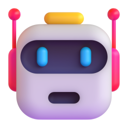

<div align="center">
  
  <h1>AgentQuary</h1>
  <p>把主题、网页或学习材料自动转换为一局可完成、可复盘的 AI 知识闯关。</p>
</div>

## 项目简介

AgentQuary 是一个面向微信小程序的 AI 泛知识问答 MVP。用户输入学习主题、公开网页链接，或上传 `.txt` / `.md` 文件后，后端调用兼容 OpenAI 协议的模型生成题目；前端负责逐题作答、即时反馈、成绩报告、错题复盘和本地历史记录。

当前版本已经跑通以下核心闭环：

> 输入学习内容 → AI 生成题目 → 逐题闯关 → 即时解析 → 成绩报告 → 历史与错题复盘

该项目仍处于 MVP 阶段。账号体系、云端同步、PDF/Word 解析、生产部署和完整安全审计尚未实现。

## 功能特性

- 支持主题文本、公开网页链接和 `.txt` / `.md` 文件输入。
- AI 生成单选题与判断题，并校验选项和答案结构。
- 支持逐题作答、即时正误反馈、答案解析和连续答对统计。
- 支持中途退出后继续闯关。
- 自动生成得分、掌握点、薄弱点和 AI 学习总结。
- 历史记录保留完整题目与报告，支持查看、重试和删除。
- 服务端包含基础 SSRF 防护、内容类型检查和响应大小限制。
- 同时支持微信小程序构建和 H5 本地预览。
- 提供本地 Mock API，可在不调用真实模型时演示完整流程。

## 技术栈

| 模块 | 技术 |
| --- | --- |
| 微信小程序 / H5 | Taro 4、React 18、TypeScript、SCSS |
| 后端 API | FastAPI、Pydantic 2、Uvicorn |
| AI 编排 | LangChain、OpenAI-compatible API |
| 数据存储 | Taro 本地存储（MVP） |
| 测试 | Pytest、TypeScript Compiler、Taro Build |

## 目录结构

```text
AgentQuary/
├─ src/                  # Taro 前端源码
│  ├─ pages/             # 首页、闯关、报告、历史页面
│  ├─ components/        # 答题选项、进度条、结果卡片
│  ├─ services/          # 前端 API 封装
│  ├─ store/             # 当前闯关状态
│  └─ assets/            # 图标与知识机器人素材
├─ server/               # FastAPI 后端
│  ├─ chains/            # 题目和报告生成链
│  ├─ routers/           # API 路由
│  ├─ services/          # 网页内容抽取与安全校验
│  └─ tests/             # 后端自动化测试
├─ prototypes/           # 产品原型页面
├─ scripts/              # Mock API 与静态预览服务
├─ doc/                  # 需求、技术方案和 MVP 状态文档
└─ config/               # Taro 构建配置
```

## 环境要求

- Node.js 18 或更高版本
- npm
- Python 3.10 或更高版本（可以使用系统 Conda 环境）
- 微信开发者工具
- 一个兼容 OpenAI API 协议的模型服务密钥

## 快速开始

### 1. 安装前端依赖

```powershell
cd E:\1_Project\AgentQuary
npm install
```

### 2. 配置前端 API 地址

复制根目录的 `.env.example` 为 `.env`：

```env
TARO_APP_API_BASE_URL=http://127.0.0.1:8000
```

如果使用手机真机调试，`127.0.0.1` 指向手机自身，必须改成电脑在同一局域网中的 IP 地址，并在微信开发者工具中正确配置合法域名或开发调试选项。

### 3. 配置并运行后端

复制 `server/.env.example` 为 `server/.env`：

```env
AI_API_KEY=your-api-key
AI_BASE_URL=https://your-provider.example/v1
AI_MODEL=your-model-name
```

使用当前机器的系统 Conda 环境运行：

```powershell
cd E:\1_Project\AgentQuary\server
E:\Anaconda3\python.exe -m pip install -r requirements-dev.txt
E:\Anaconda3\python.exe -m uvicorn main:app --host 127.0.0.1 --port 8000
```

启动后可访问：

- API 根地址：`http://127.0.0.1:8000/`
- Swagger 文档：`http://127.0.0.1:8000/docs`

### 4. 运行微信小程序前端

在新的 PowerShell 窗口执行：

```powershell
cd E:\1_Project\AgentQuary
npm run dev:weapp
```

看到 `Compiled successfully` 和 `Watching...` 即表示编译监听已启动。随后用微信开发者工具导入项目根目录，编译产物位于 `dist/weapp/`。

## H5 本地演示

不接入真实模型时，可以使用内置 Mock API。分别打开三个终端执行：

```powershell
npm run dev:mock-api
```

```powershell
npm run build:h5
```

```powershell
npm run preview:h5
```

浏览器访问 `http://127.0.0.1:4175/`。

## 常用命令

| 命令 | 作用 |
| --- | --- |
| `npm run dev:weapp` | 监听并编译微信小程序 |
| `npm run build:weapp` | 单次构建微信小程序 |
| `npm run build:h5` | 构建 H5 版本 |
| `npm run preview:h5` | 预览已构建的 H5 版本 |
| `npm run dev:mock-api` | 启动本地 Mock API |
| `node_modules\.bin\tsc.cmd --noEmit` | 执行 TypeScript 类型检查 |
| `E:\Anaconda3\python.exe -m pytest -q` | 在 `server` 目录运行后端测试 |

## API 概览

| 方法 | 路径 | 用途 |
| --- | --- | --- |
| `GET` | `/api/examples` | 获取首页示例题材 |
| `POST` | `/api/generate` | 根据主题、网页或文本生成题目 |
| `POST` | `/api/report` | 根据答题结果生成学习报告 |

具体请求与响应结构请以后端启动后的 Swagger 文档为准。

## 当前验证状态

- TypeScript 类型检查通过。
- 微信小程序构建通过。
- H5 构建通过。
- 后端自动化测试：`13 passed`。
- 已验证从生成题目、完成答题到报告和历史复盘的 MVP 流程。

## 已知限制

- 真实模型输出的稳定性、费用、限流和失败重试仍需持续压测。
- 当前文件解析仅支持纯文本，不支持 PDF、Word 和图片 OCR。
- 历史记录仅保存在本地，暂不支持登录和跨设备同步。
- 复杂动态网页、登录墙和反爬页面可能无法提取正文。
- 微信分享卡片和真机网络环境仍需在真实设备上验收。
- H5 入口体积仍有优化空间。

更完整的实现状态和下一阶段建议见 [MVP 实现状态](doc/MVP实现状态.md)。

## 安全说明

- 不要提交根目录 `.env`、`server/.env` 或任何真实 API Key。
- 当前仓库已通过 `.gitignore` 排除本地密钥、虚拟环境、依赖目录和构建产物。
- 正式部署前仍需补充鉴权、限流、日志脱敏、出站网络策略和生产级 CORS 配置。

## 素材许可

- 界面图标来自 Lucide，许可文件位于各图标资源目录。
- 知识机器人素材来自 Microsoft Fluent Emoji，许可文件位于 `src/assets/mascot/`。
