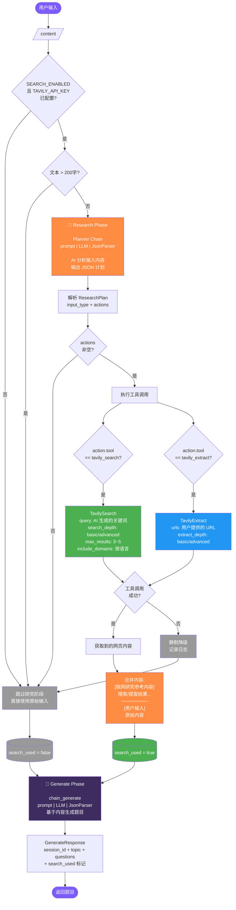

## Context

当前题目生成流程：用户输入 → `normalize_content`（URL 抓取 / 文本截断）→ `chain_generate.ainvoke`（LLM 生成）→ 返回题目。

问题：当用户输入短主题如 "Harness Engineering" 时，`normalize_content` 直接返回原始文本，LLM 依赖自身训练数据生成题目。若训练数据未覆盖该主题，会给出错误或无关的题目。此外，用户可能直接粘贴一个 URL，现有 URL 抓取逻辑（`httpx`）质量有限，无法处理 JavaScript 渲染页面或复杂结构。

现有架构约束：
- 后端使用 LangChain LCEL chain（prompt | llm | parser）
- `services/content.py` 已有 URL 抓取和 HTML 解析能力
- 配置使用 `pydantic-settings`
- LLM 为 MiMo 2.5 Pro（OpenAI 兼容 API）

## Goals / Non-Goals

**Goals:**
- 将 TavilySearch 和 TavilyExtract 作为工具提供给 AI，由 AI 自主决定调用哪些工具
- 支持关键词搜索和 URL 内容提取两种场景
- 根据内容复杂度动态调整搜索参数（搜索深度、结果数量、域名偏好等）
- 搜索失败时优雅降级，不阻断现有流程
- 对现有 API 接口无破坏性变更

**Non-Goals:**
- 不实现向量数据库或 embedding 检索
- 不实现搜索结果缓存（后续可扩展）
- 不修改前端代码（后端内部优化）
- 不支持用户手动选择搜索引擎或参数

## 业务流程



## Decisions

### Decision 1: 架构 — 两阶段流水线（Research → Generate）

**选择**: 在现有题目生成 chain 之前新增"研究阶段"，形成两阶段流水线

**流程**:
```
用户输入 → [研究阶段] → 拼接内容 → [生成阶段] → 返回题目
              ↓
         AI 分析输入
         选择工具 & 参数
         执行 TavilySearch / TavilyExtract
         返回获取的内容
```

**理由**:
- 研究阶段与生成阶段解耦，各自独立优化
- 生成阶段的 chain 无需修改，只接收更丰富的 content
- 研究阶段可以灵活添加/移除工具
- 降级逻辑集中在研究阶段，生成阶段无需感知

### Decision 2: AI 工具选择机制 — Structured Output Planning

**选择**: 使用 LLM 的 structured output 能力，让 AI 输出 JSON 计划来决定调用哪些工具

**理由**:
- MiMo 2.5 Pro 走 OpenAI 兼容 API，可能不支持原生 function calling
- 即使支持，structured output 比 agent loop 更可控、更可预测
- 只需一次 LLM 调用即可完成规划，避免 agent loop 的多轮延迟

**实现方式**: 使用 LangChain 的 `JsonOutputParser` + Pydantic schema，让 LLM 输出工具调用计划

**计划 schema**:
```python
class ToolAction(BaseModel):
    tool: str  # "tavily_search" | "tavily_extract" | "none"
    # TavilySearch 参数
    query: str | None = None
    search_depth: str = "basic"  # "basic" | "advanced"
    max_results: int = 3
    include_domains: list[str] | None = None
    time_range: str | None = None  # "day" | "week" | "month" | "year"
    # TavilyExtract 参数
    urls: list[str] | None = None
    extract_depth: str = "basic"  # "basic" | "advanced"

class ResearchPlan(BaseModel):
    input_type: str  # "url" | "topic" | "text" | "mixed"
    reasoning: str
    actions: list[ToolAction]
```

**备选方案**:
- LangChain Agent（ReAct / Tool Calling）：多轮调用，延迟高，对 MiMo 兼容性不确定
- 程序化判断：硬编码规则，无法处理复杂场景（如用户同时给出 URL 和关键词）

### Decision 3: 工具集 — TavilySearch + TavilyExtract

**选择**: 使用 `langchain-tavily` 包提供的 `TavilySearch` 和 `TavilyExtract`

**TavilySearch 可调参数**:

根据[官方文档](https://docs.langchain.com/oss/python/integrations/tools/tavily_search)，参数分为两类：

*实例化时设置（不可在调用时动态修改）*:
| 参数 | 说明 | 设置策略 |
|------|------|---------|
| `include_raw_content` | 是否返回完整网页 HTML | 设为 `False`（默认值）。每条结果自带 snippet（200-500 字），已足够 LLM 理解主题。需要完整内容时由 AI 在计划中调用 TavilyExtract |
| `include_answer` | 是否返回 AI 摘要答案 | 设为 `False`，我们自己生成题目 |

*调用时可动态设置（由 AI 在计划中指定）*:
| 参数 | 说明 | 动态调整策略 |
|------|------|-------------|
| `query` | 搜索关键词 | AI 根据用户输入生成 |
| `search_depth` | `"basic"` 或 `"advanced"` | 复杂/冷门主题 → advanced |
| `max_results` | 返回结果数量 (1-10) | 简单主题 3 条，复杂主题 5 条 |
| `include_domains` | 限定搜索域名 | 中文主题可限定知乎、百度百科等 |
| `exclude_domains` | 排除搜索域名 | 排除低质量来源 |
| `time_range` | 时间范围 | 有时效性需求时设置 day/week/month/year |

**TavilyExtract 可调参数**:

根据[官方文档](https://docs.langchain.com/oss/python/integrations/tools/tavily_extract)：

*调用时可动态设置*:
| 参数 | 说明 | 动态调整策略 |
|------|------|-------------|
| `urls` | 要提取的 URL 列表 | 用户输入的 URL |
| `extract_depth` | `"basic"` 或 `"advanced"` | 复杂页面 → advanced |

**理由**:
- 两个工具覆盖两种场景：搜索（不知道具体内容）和提取（已知 URL）
- LangChain 原生集成，与现有技术栈一致
- 免费额度 1000 次/月（搜索 + 提取共享），MVP 阶段足够
- `include_raw_content` 在实例化时固定为 True，确保 AI 总能获取完整内容；超出 LLM 上下文的部分由研究阶段截断

### Decision 4: 动态参数策略 — AI 根据内容复杂度自主决定

**选择**: 在研究阶段的 system prompt 中描述参数调整策略，由 AI 自主决定

**Planner System Prompt 草案**:
```
你是一个内容研究助手。你的任务是分析用户输入，决定需要调用哪些工具来获取知识内容。

可用工具：
1. tavily_search — 通过关键词搜索互联网
   可调参数：query, search_depth("basic"/"advanced"), max_results(1-10),
   include_domains, exclude_domains, time_range("day"/"week"/"month"/"year")
2. tavily_extract — 从指定 URL 提取网页完整内容
   可调参数：urls, extract_depth("basic"/"advanced")

参数调整规则：
1. 搜索深度：专业/冷门/技术性主题用 "advanced"，常见/通俗主题用 "basic"
2. 结果数量：简单主题 3 条，复杂主题 5 条
3. 域名偏好：中文主题可优先 include_domains=["zhihu.com", "baike.baidu.com"]
4. 时间范围：有时效性的主题设置 time_range
5. 提取深度：结构简单的页面用 "basic"，复杂页面（如 Wikipedia 长文）用 "advanced"
6. 混合输入：如果用户同时给出 URL 和关键词，可以同时调用两个工具

输入类型判断：
- 如果输入是 URL（以 http/https 开头）→ 调用 tavily_extract
- 如果输入是短文本（≤200 字）且不是 URL → 调用 tavily_search
- 如果输入是长文本（>200 字）→ tool="none"，已有足够信息
- 如果输入同时包含 URL 和文字说明 → 调用对应的工具

{format_instructions}
```

**理由**:
- AI 对内容复杂度的判断比硬编码规则更准确
- 不同主题需要的信息量差异很大，AI 可以灵活调整
- 策略写在 prompt 中，可以随时迭代优化

### Decision 5: 降级策略 — 静默降级

**选择**: 工具调用失败时不报错，静默回退到纯 LLM 生成

**降级链**:
```
Research Plan 生成成功 → 执行工具 → 获取内容 → 拼接 → 生成题目
         ↓ 失败                    ↓ 失败
    使用原始输入 ──────────────────→ 使用原始输入 → 生成题目
```

**理由**:
- 联网研究是增强功能，不应阻断核心流程
- 用户无感知，体验不中断
- 日志记录失败原因，便于排查

### Decision 6: 新增响应字段 — search_used 标记

**选择**: 在 `GenerateResponse` 中新增 `search_used: bool` 字段

**理由**:
- 前端可据此展示"基于联网搜索生成"的提示
- 便于调试和监控搜索功能的使用情况
- 可选字段，默认 false，不影响现有客户端

## Risks / Trade-offs

**[MiMo structured output 兼容性]** → MiMo 2.5 Pro 可能不支持 JSON schema 约束输出。缓解：使用 JsonOutputParser（prompt 注入格式说明 + 自动重试），已在现有 generate_chain 中验证可行。

**[研究阶段增加延迟]** → 研究阶段需要一次 LLM 调用（规划）+ 一次工具调用（搜索/提取），增加 5-15 秒延迟。缓解：只在短输入时触发；长文本跳过研究阶段直接生成。Planner chain 使用较低 temperature 和 max_tokens 降低延迟。

**[Tavily 国内访问]** → Tavily 服务器在海外，国内访问可能不稳定。缓解：工具调用超时 15 秒，失败后静默降级。

**[Tavily 免费额度]** → 免费 1000 次/月（搜索+提取共享）。缓解：MVP 阶段用量预计在额度内；`SEARCH_ENABLED=false` 可关闭；监控使用量。

**[Token 消耗控制]** → TavilySearch 默认返回 snippet（200-500 字/条），5 条结果约 1000-2500 字，对 LLM 上下文友好。`include_raw_content` 设为 `False`，不返回完整 HTML。如果 AI 判断需要某个网页的完整内容，会在计划中调用 TavilyExtract 针对性获取。所有获取的内容在传给生成 chain 前截断到 `MAX_CONTENT_CHARS`（12000 字）。

**[研究阶段 LLM 额外成本]** → 研究阶段需要一次额外的 LLM 调用。缓解：planner chain 使用较低 temperature（0.3）和较短 max_tokens，降低延迟和成本。

**[Tavily API Key 管理]** → 需要在 `.env` 中配置 API Key。缓解：`pydantic-settings` 已有成熟的配置管理机制，`SEARCH_ENABLED=false` 时不需要 key。
